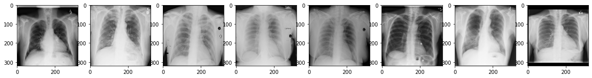
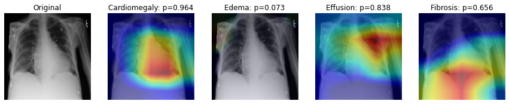

# Chest X-ray Medical Diagnosis with DenseNet121
Practice on chest X-ray pathology multi-classification based on CheXNet paper. 
This project is a practice for CheXNet paper with also the reference on Coursera "AI for Medicine Dianosis". 
For details on the CheXNet Paper: [CheXNet](https://arxiv.org/abs/1711.05225)

We will be using the [ChestX-ray8 dataset](https://arxiv.org/abs/1705.02315) which contains 108,948 frontal-view X-ray images of 32,717 unique patients. 

- Each image in the data set contains multiple text-mined labels identifying 14 different pathological conditions. 
- These in turn can be used by physicians to diagnose 8 different diseases. 
- We will use this data to develop a single model that will provide binary classification predictions for each of the 14 labeled pathologies. 
- In other words it will predict 'positive' or 'negative' for each of the pathologies.
 
- Full dataset is [here](https://nihcc.app.box.com/v/ChestXray-NIHCC). We use the X-ray in the file "images_001.tar" with 4999 samples

Before you start, there are steps you should follow:
1. download and unzip the files in the directory `./images`
2. download `train_val_list.txt` and `test_list.txt` and `Data_Entry_2017*.csv`
3. run `csv_extractor` to combine the above information into one csv.file. The default ouput will be "my_list.csv".

GradCAM result demo:

